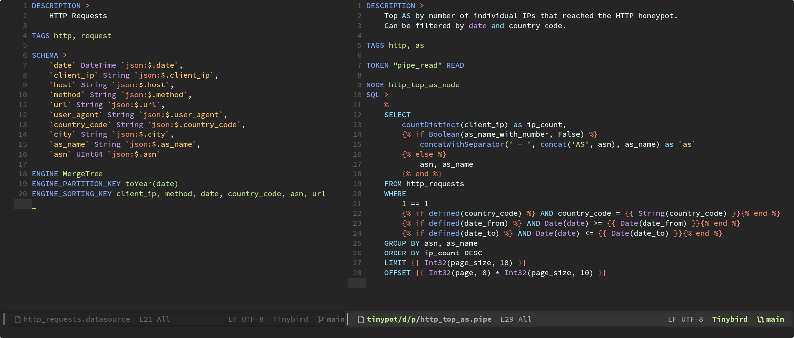

# `tinybird-mode` for Emacs

Major mode for editing [Tinybird Datafiles](https://www.tinybird.co/docs/cli/datafiles/overview)
on Emacs.

**WARNING:** This is a work in progress, current version have some caveats due
to the lax specification of the language and using regex to parse it. It works
most of the time but has some minor glitches. I'll attempt another approach in
the future.



## Install

Currently it is not published neither in ELPA nor MELPA as I want to try to
achieve a better version.

For now you can install it using `use-package` from `vc` (Emacs 30+):

```lisp
;; If running Emacs<30
(unless (package-installed-p 'vc-use-package)
  (package-vc-install "https://github.com/slotThe/vc-use-package"))
(require 'vc-use-package)

;; Install tinybird-mode
(use-package tinybird-mode
  :vc (tinybird-mode :url "https://github.com/skgsergio/tinybird-mode"
                     :rev :newest))
```

## TODO

- [ ] Try to avoid using regex (Search-based Font Lock) using either Syntactic
      Font Lock or Parsed-based Font Lock.
- [ ] Auto-format on save.
- [ ] Publish on MELPA.
